# Database Design & Entity-Relationship Diagram

## AyurSutra — Phase 2 MySQL Schema

Phase 1 uses mock data in the browser. The structure below defines the MySQL schema that will be implemented in Phase 2 using SQLAlchemy ORM models.

---

## 1. Entity-Relationship Diagram

```mermaid
erDiagram
    roles {
        VARCHAR id PK
        VARCHAR name UK "admin|doctor|receptionist"
        VARCHAR label
    }

    users {
        VARCHAR id PK
        VARCHAR name
        VARCHAR email UK
        VARCHAR password_hash
        VARCHAR role FK
        BOOLEAN active
        TIMESTAMP created_at
    }

    patients {
        VARCHAR id PK
        VARCHAR full_name
        DATE date_of_birth
        ENUM gender "Male|Female|Other"
        VARCHAR phone UK
        VARCHAR email
        TEXT address
        TEXT medical_history
        VARCHAR emergency_contact
        TIMESTAMP registered_at
        VARCHAR registered_by FK
    }

    therapies {
        VARCHAR id PK
        VARCHAR name UK
        TEXT description
        INT default_duration_mins
        BOOLEAN active
    }

    therapists {
        VARCHAR id PK
        VARCHAR name
        VARCHAR specialization
        BOOLEAN active
    }

    therapist_availability {
        VARCHAR id PK
        VARCHAR therapist_id FK
        ENUM day_of_week "Mon|Tue|Wed|Thu|Fri|Sat|Sun"
        TIME start_time
        TIME end_time
    }

    therapist_leaves {
        VARCHAR id PK
        VARCHAR therapist_id FK
        DATE start_date
        DATE end_date
        VARCHAR reason
    }

    therapy_rooms {
        VARCHAR id PK
        VARCHAR name UK
        VARCHAR room_type
        BOOLEAN active
    }

    emr_records {
        VARCHAR id PK
        VARCHAR patient_id FK
        VARCHAR doctor_id FK
        TEXT symptoms
        TEXT diagnosis
        TEXT treatment_plan
        VARCHAR therapy_id FK
        INT therapy_duration_mins
        INT number_of_sessions
        TEXT doctor_notes
        DATE follow_up_date
        TIMESTAMP created_at
    }

    appointments {
        VARCHAR id PK
        VARCHAR patient_id FK
        VARCHAR therapy_id FK
        VARCHAR therapist_id FK
        VARCHAR room_id FK
        DATE date
        TIME start_time
        TIME end_time
        ENUM status "Scheduled|Confirmed|Completed|Cancelled"
        VARCHAR created_by FK
        TIMESTAMP created_at
    }

    roles ||--o{ users : "has"
    users ||--o{ patients : "registered_by"
    users ||--o{ emr_records : "doctor"
    users ||--o{ appointments : "created_by"
    patients ||--o{ emr_records : "has"
    patients ||--o{ appointments : "has"
    therapies ||--o{ emr_records : "prescribed_in"
    therapies ||--o{ appointments : "used_in"
    therapists ||--o{ therapist_availability : "has"
    therapists ||--o{ therapist_leaves : "takes"
    therapists ||--o{ appointments : "assigned_to"
    therapy_rooms ||--o{ appointments : "hosts"
```

---

## 2. Table Descriptions

### `roles`
Reference table for user roles. Seeded at startup; not user-editable.

### `users`
Staff accounts. Role determines navigation and endpoint access. Passwords stored as bcrypt hashes. A soft-delete pattern (setting `active = false`) is preferred over hard deletes.

### `patients`
One record per patient. `registered_by` references the user who created the record. Phone and email carry unique constraints to prevent duplicate registrations.

### `therapies`
Master data for available therapy types. Seeded with: Abhyanga, Shirodhara, Basti, Nasya, Swedana. Only active therapies appear in dropdowns.

### `therapists`
Practitioner records. Specialisation links conceptually to therapies they can deliver (explicit junction table added in Phase 3 if needed). Active flag controls visibility.

### `therapist_availability`
Recurring weekly schedule per therapist. Each row = one working day with start/end time. Used by the scheduling engine to determine if a therapist is working on a given date.

### `therapist_leaves`
Date-range leave records. The scheduling engine skips any therapist with a leave that overlaps the requested date.

### `therapy_rooms`
Physical rooms in the treatment centre. Active flag controls availability.

### `emr_records`
One record per consultation. Contains clinical details and the therapy prescribed. Read-only after creation (amendments stored as new records in Phase 3+).

### `appointments`
Confirmed therapy sessions. Links patient, therapy, therapist, room, and time. The scheduling engine checks existing appointments for conflicts before proposing new slots.

---

## 3. Key Constraints

| Constraint | Implementation |
|---|---|
| Duplicate patient prevention | UNIQUE on `patients.phone` and `patients.email` |
| Appointment conflict prevention | Application-level check in scheduling service + DB-level unique index on `(therapist_id, date, start_time)` and `(room_id, date, start_time)` |
| Referential integrity | Foreign keys with `ON DELETE RESTRICT` |
| Status validation | ENUM type on `appointments.status` |

---

## 4. Future Tables (Phase 3+)

These tables are identified but not implemented in Phase 1 or 2:

| Table | Purpose |
|---|---|
| `billing_records` | Invoice and payment tracking per appointment |
| `inventory_items` | Oils, herbs, consumables used per therapy |
| `inventory_usage` | Consumption log per appointment |
| `notifications` | Audit trail of SMS/email/WhatsApp sent |
| `branches` | Multi-location support |
| `therapist_therapies` | Many-to-many junction for therapist ↔ therapy mapping |
